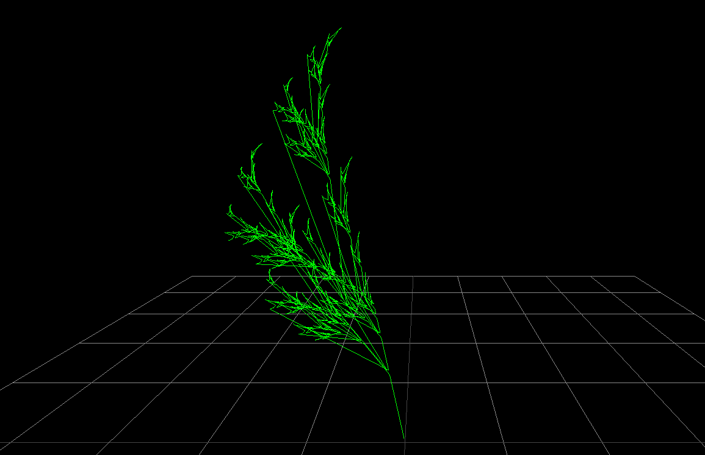
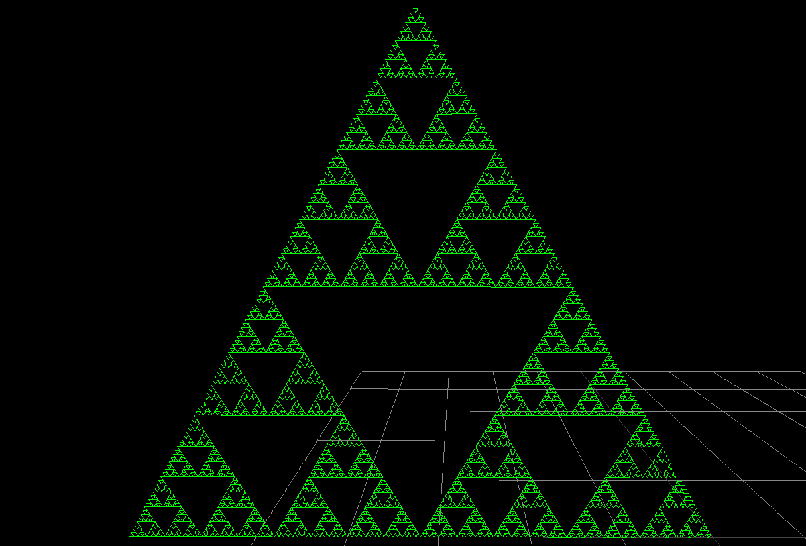

# 3D L-system renderer with THREE.js

Renders [L-systems](https://en.wikipedia.org/wiki/L-system) in 3D.

[Click here to go to the renderer](https://darkeclipz.github.io/3d-l-systems/)

## Example 1: Plant

## Example 2: Sierpinski

## Ruleset

 * `F` : Forward.
 * `X+` : Turn n-degrees in the x-axis.
 * `X-` : Turn negative n-degrees in the x-axis.
 * Also for `Y` and `Z`.
 * `[` : Push the state.
 * `]` : Pop the state.
 * `A` : Don't draw this.

